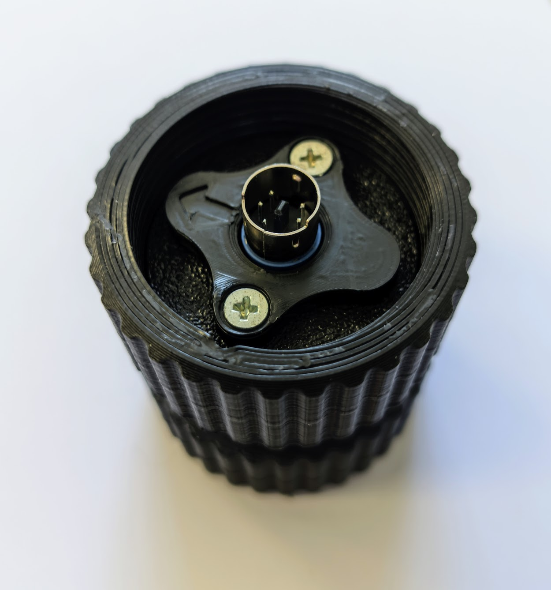

# Grip Adapters

The VPforce mainboard uses a Thrustmaster-compatible 5-pin grip interface. The adapter you need depends on which grip manufacturer you use.

---

## Native Support (No Adapter Required)

- **Thrustmaster grips** (Cougar, Warthog, F/A-18C) — connect directly to the 5-pin interface. Up to 24 buttons.
- **Virpil grips** (MongoosT-50, WarBRD, Constellation Alpha, Alpha Prime, VFX, AH-64, UH-60, FLNKR) — connect directly. Analog axis data and LED control are supported natively.
- **FC Technologies grips** — connect directly to the 5-pin interface.

---

## WinWing Adapter

{ width="200px" }

Converts WinWing's proprietary protocol to the TM 5-pin standard, both mechanically and electrically. Unlike native TM/Virpil connections, the WinWing adapter passes **analog axis data** (brake levers, thumbsticks) to the mainboard.

**Tested and working with:** WinWing F-16EX, F-18.

**Setup:**

1. Mount the WinWing grip onto the adapter.
2. In the VPforce Configurator, select **"WinWing adapter"** as the grip type in the drop-down menu.

!!! note "Button 32 indicator"

    On newer WinWing adapter firmware revisions, button 32 will activate if the grip connection is not detected or disconnected. This is normal behavior, not an error.

!!! note "Analog axis calibration"

    In rare cases, a WinWing grip may not report analog axis data out of the box. Perform an analog calibration using the WinWing software on a WinWing base first, then reconnect to the Rhino.

---

## VKB Adapter

{ width="200px" }

Mounts any socket rev. B or rev. C style VKB grip to the Rhino or DIY base.

**Requirements:**

- The VKB adapter (mechanical mount)
- A VKB main controller ("black box") — required to operate the grip buttons

**How it works:**

There is no electrical connection between the adapter and the VPforce mainboard. The black box connects to the grip via the external adapter cable and handles all button inputs independently. The black box will blink a red light because it does not see any axis inputs — this is normal and does not affect operation.

**Installing the adapter:**

Push the connector into the grip until it makes contact, then secure with the locking collar. If the connector is tight, do not apply force to the rotating lower part only — rotate the entire lower half. Sitting on or applying force to the adapter body is not recommended as it can pinch internal wiring.

**Using VKB buttons in VPforce software:**

To use VKB grip buttons for VPforce functions (e.g., force trim), the **RhinoLoopback** companion app is required. See the relevant section in the [Rhino manual](../rhino/using-the-rhino.md) for setup details.

---

## Custom Grips (Shift-Register)

The VPforce mainboard supports custom-built grips using generic shift-register button inputs via the 5-pin interface. Select **"Generic (shift-register)"** as the grip type in the VPforce Configurator.

This allows DIY builders to wire their own button matrices using shift registers (e.g., 74HC165) connected to the mainboard's SPI interface.

---

## Further Reading

- [Physical Setup (Rhino Manual)](../rhino/getting-started.md) — full adapter installation instructions with photos
