# Using the RHINO

The **VPforce RHINO** is a capable but configurable device. Different simulators handle force feedback in different ways, some need third-party tools, and advanced behavior often depends on how those layers interact. This guide explains what each part does and how to get predictable results.

Out of the box, the RHINO usually works well with sensible defaults. Before changing everything, fly a few sessions first. That gives you a baseline for how the stick feels in your preferred simulator and makes later tuning far easier.

This manual covers the **VPforce FFB Configurator**, the **RhinoLoopback** application, and the basics of **TelemFFB**. It also explains key force-feedback terms, common setup tasks, and the relationship between simulator-controlled and device-controlled effects.

The goal is simple: help you tune the RHINO with confidence and understand why it feels the way it does.

## Overview and Force Feedback Terminology

### FFB Overview

Force Feedback - also known as *control loading* - applies physical resistance and motion to your controls, simulating the forces you would feel in a real aircraft, car, or machine.

In practice, it means your stick can "push back" when you pull too hard, your pedals can feel like they're fighting air pressure, and your yoke can suddenly go light when you stall - all thanks to small but surprisingly determined motors.

Force Feedback can mimic many mechanical sensations: the stiffness of control surfaces, the suspension of a car, or the sluggish momentum of a heavy mechanism. By linking these cues to simulator data, FFB improves both immersion and control feel.

Combined with motion tracking or telemetry-driven effects, Force Feedback helps simulations feel physically convincing instead of only visually convincing.

### FFB Effect Types

- **Periodic Effects** Generate repeating waveforms such as sine, triangle, or square waves. By adjusting amplitude, frequency, and phase, they simulate vibrations, oscillations, or pulses - from engine rumble to weapon recoil.

- **Spring** Provides a centering force that increases with displacement, like stretching a spring. Used to simulate the natural pull toward neutral position - for example, the resistance you feel when deflecting aircraft controls.

- **Damper** Applies resistance proportional to how fast the control is moving, similar to pushing through oil or honey. The faster you move, the stronger the resistance.

- **Inertia** Simulates momentum - the tendency of a heavy object to keep moving once it starts. The control feels like it has mass and resists quick direction changes.

- **Friction** Applies a steady resistance regardless of speed, like dragging the control across sandpaper (or butter, if set lightly). Useful for simulating surface contact or mechanical stiffness.

- **Constant** Produces a continuous force in a fixed direction. Despite the name, it can be dynamically updated by software, allowing it to simulate everything from sustained aerodynamic pressure to the subtle pull of trim or wind.

## The VPforce Configurator Software

The **VPforce FFB Configurator** is the primary tool for configuring your Rhino's force feedback behavior. This application allows you to fine-tune everything from spring force and damping to button mappings and advanced effects.

!!! note
    Some sections below may not fully reflect the latest software version. Always refer to the in-app tooltips and latest release notes for the most up-to-date information.

### Interface Overview

The Configurator window is divided into two main areas:

**Left Pane - Real-Time Telemetry:**
Displays live data from your Rhino, including axis positions, force outputs, button states, and other diagnostic information. This real-time feedback is invaluable when tuning effects and troubleshooting issues.

**Right Pane - Configuration Tabs:**
Contains four main tabs where you can modify the Rhino's behavior:

- **Effects** - Configure individual force feedback effects
- **Settings** - Adjust global gain multipliers for all effects
- **Debug** - Access diagnostic tools and advanced settings
- **Button Mapping** - Configure button assignments and functions

### Effects Tab

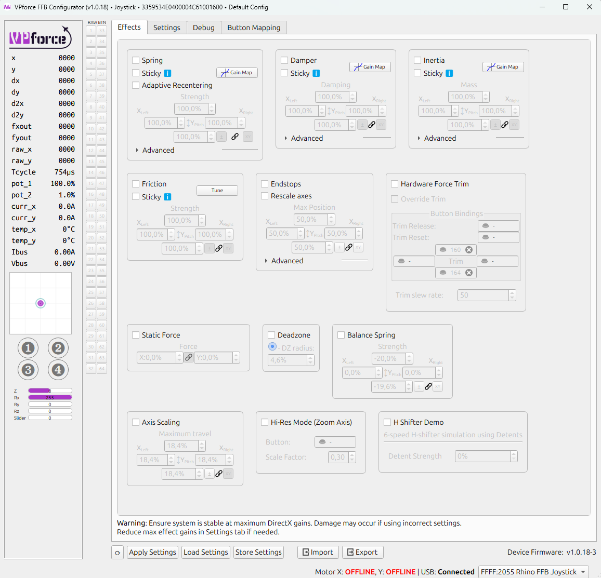{ width="671px" height="647px" }

The **Effects Tab** is where you configure the individual force feedback effects that the Rhino generates locally. Each effect can be independently enabled or disabled using its checkbox. When enabled, the effect becomes part of the force feedback you feel during use.

!!! important "Effects Tab vs Simulator Control"
    Effects configured here are active when no simulator is running or when a simulator doesn't override them. When a game or simulator sends its own FFB commands, it can selectively override specific effect types while leaving others active.

#### Available Effects

- **Spring Effect** - Generates a centering force that behaves like a physical spring, pulling the joystick back toward its center position. The further you move from center, the stronger the pull becomes. This is the foundation of most force feedback experiences.
    - **Common Parameters:**

        - **Gain:** Overall strength multiplier for the effect (0-100%)
        - **Saturation:** Maximum output level as a percentage of total available force
        - **Deadband:** Range near the center where no force is applied, useful for creating a "dead zone"

- **Damper Effect** - Simulates resistance similar to moving the joystick through a viscous fluid like oil or honey. The faster you move the stick, the stronger the opposing force becomes. This effect adds a sense of weight and prevents overly twitchy movements.

- **Inertia Effect** - Simulates momentum and mass, making the joystick resist changes in motion. When you start moving the stick, it feels like it wants to continue moving in that direction. This creates a sense of physical mass and realistic control inertia.

- **Friction Effect** - Simulates a constant, static resistance to movement, similar to dragging the joystick through a mechanical friction joint or over a rough surface. Unlike damper, friction force is constant regardless of speed.

- **Endstops** - Generates a firm resistance when the joystick reaches a defined boundary, preventing further movement. The endstop parameters can be adjusted in the green and red boxes under the **End Stops** section of the page.

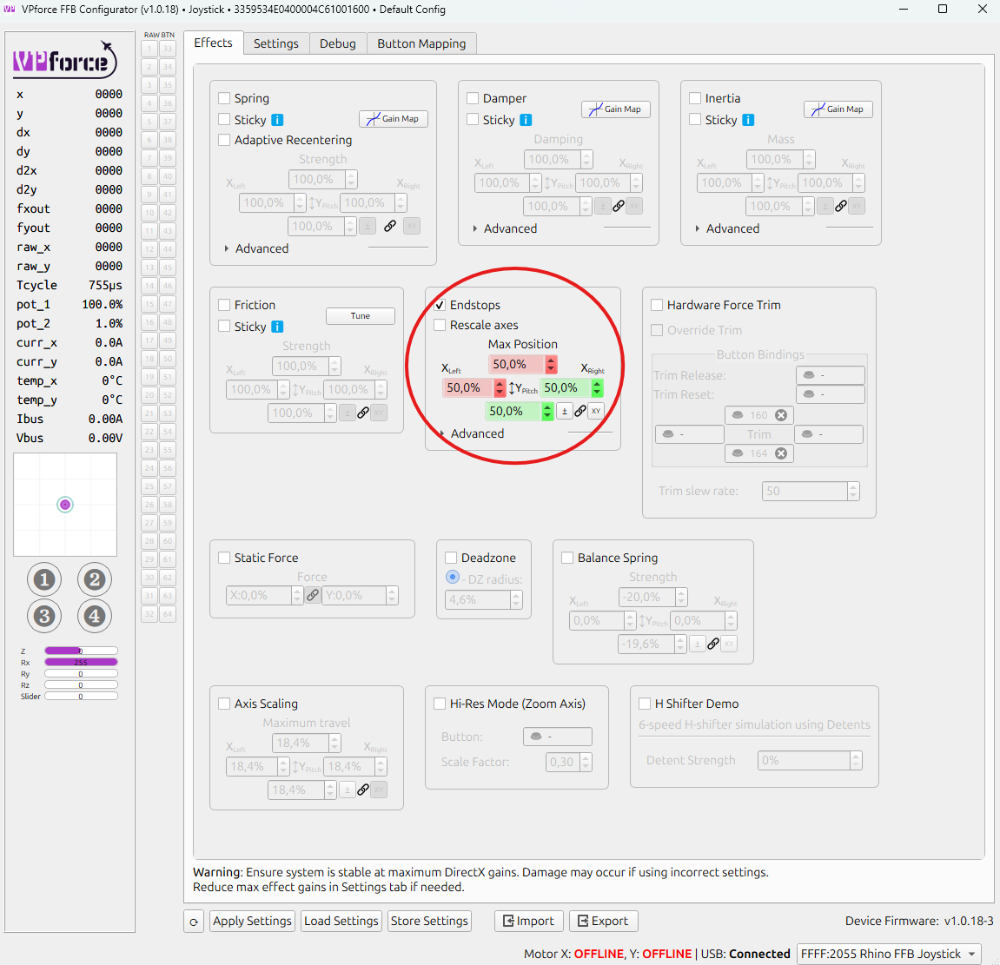{ width="671px" height="648px" }

In the example above, the endstops are configured at **50% of Y-axis travel** in both directions, with **50% of the maximum available force** applied at each endstop. Each direction is represented by a different colored box: **green** for pushing the stick *toward* you, and **red** for pulling it *away from* you.

With this setup, the stick moves freely for about half of its travel in either direction - offering no resistance at all. It feels completely limp until it reaches the halfway point. Once there, a firm resistance begins to build.

In the small graph at the lower left of the picture, the **red dot** represents stick displacement, while the **blue circle** shows the force vector generated by the motors. In this case, the red dot sits halfway forward (where resistance starts), and the blue dot remains centered, indicating that the motors are just beginning to push back.

If you continue to push the stick further into the resistance zone, the red dot advances toward the end of its range. The motors respond by applying up to **half of their maximum force**, pushing firmly against your input - just as the graph below illustrates.

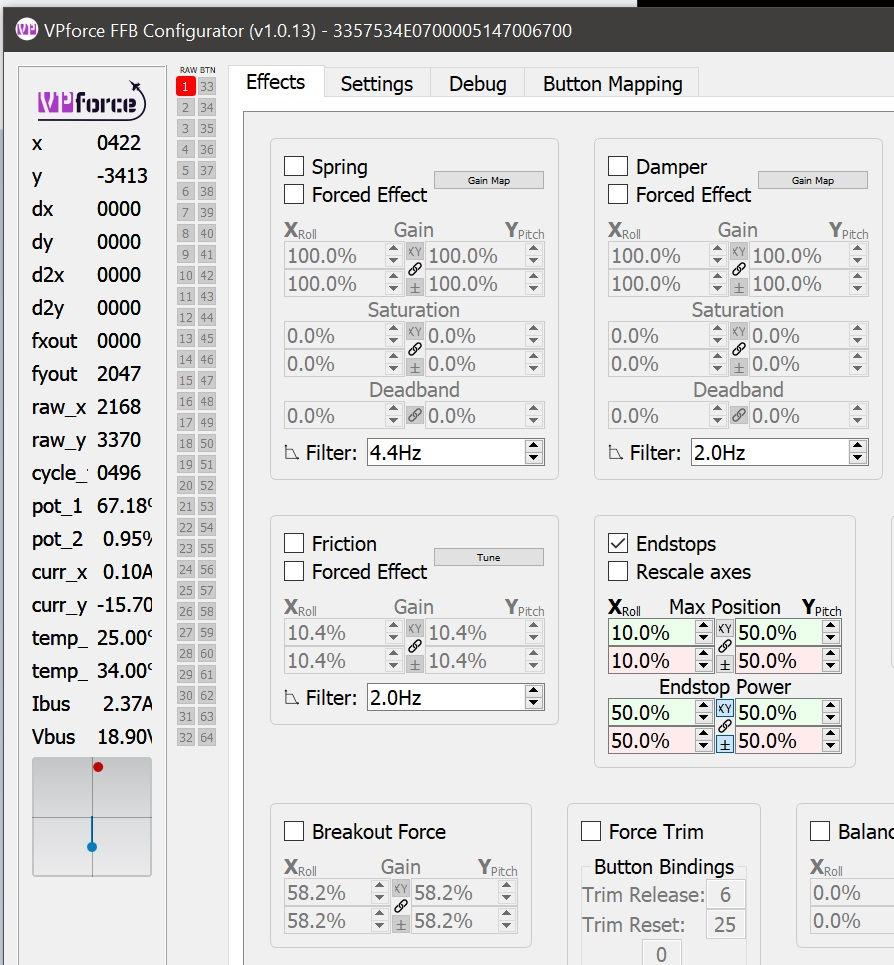{ width="572px" height="617px" }

If the **Rescale Axes** box is checked, the joystick reports full excursion to the computer when it reaches an endstop. In the example below, the red dot has moved to the limit of the small box. The blue dot remains centered because the motors are not applying force.

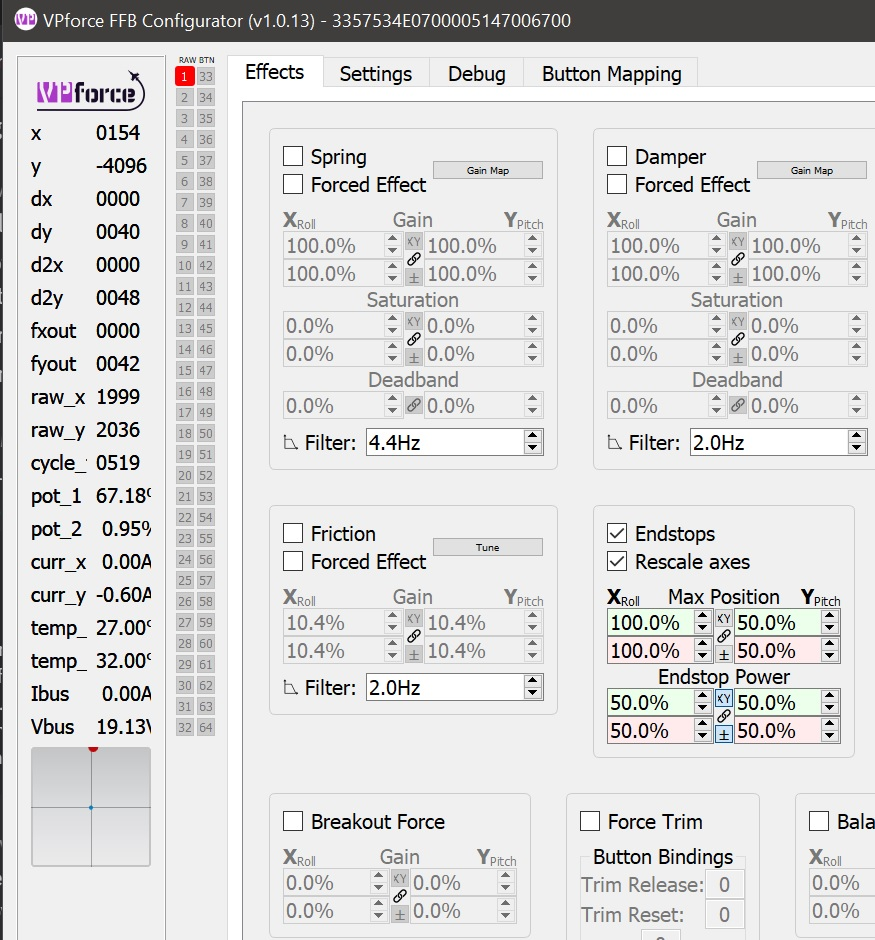{ width="624px" height="671px" }

**Constant Force**

Produces a continuous force in a fixed direction. While the name suggests it's unchanging, this effect can be dynamically updated by software to simulate sustained forces like aerodynamic pressure, G-forces, or control surface loading.

**Breakout Force**

Simulates the initial resistance or "stiction" that must be overcome before a control begins to move. This mimics mechanical systems where static friction is higher than dynamic friction - like breaking free from a tight bearing or hydraulic valve.

**Hardware Force Trim**

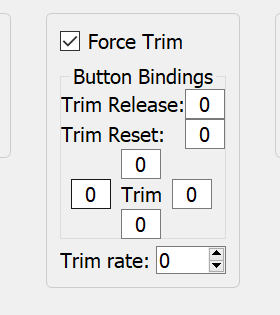{ width="280px" height="315px" }

This setting enables hardware-based force trim functionality, particularly useful for helicopter simulation. When enabled:

- The four fields surrounding the word 'Trim' are button assignments for **pitch** and **roll** trim adjustment
- A **trim release** button can be configured to temporarily disable the trim and return control to manual input
- The trim system works by dynamically adjusting the spring center point, allowing you to "hold" a position without constant input

This is essential for realistic helicopter flight where force trim is a standard feature that allows pilots to reduce control forces during sustained maneuvers.

**Balance Spring**

The Balance Spring feature compensates for grip weight and extension length to prevent the stick from sagging or drifting when trimmed at an angle. This is covered in detail in **[Balancing the Grip](#balancing-the-grip)**.

### Settings Tab

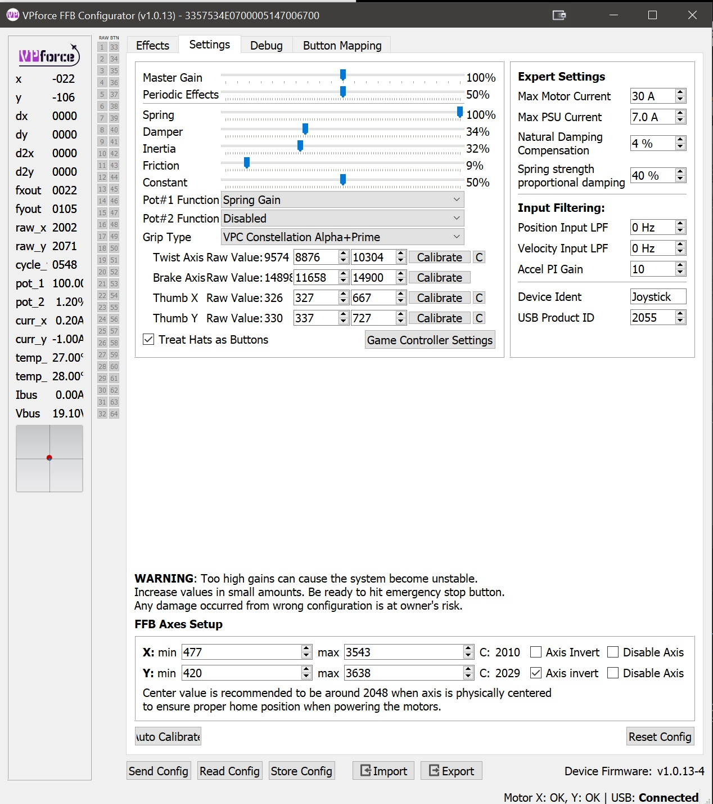{ width="624px" height="702px" }

The **Settings Tab** provides global gain multipliers for each force feedback effect type. These sliders act as maximum force limiters and apply to **all** effects, whether they come from the Configurator, a game, or TelemFFB.

#### How Settings Work

Each slider controls the maximum output percentage for its corresponding effect type. The actual force you feel is calculated as:

**Final Force = (Effect Gain) × (Settings Multiplier)**

**Example:**
- Spring effect set to 50% in Effects tab
- Spring slider set to 50% in Settings tab
- **Result:** You will feel 25% of maximum spring force (0.50 × 0.50 = 0.25)

#### Key Differences from Effects Tab

- **Effects Tab:** Configures local effects and their individual parameters
- **Settings Tab:** Sets universal maximum limits that **always** apply, regardless of source

Think of the Effects tab as defining effect behavior, while the Settings tab defines the overall limit for each effect type.

!!! tip "Quick Adjustment Strategy"
    Use the Settings tab for quick, global adjustments to overall force levels without losing your carefully tuned effect configurations in the Effects tab. This is particularly useful when switching between different aircraft or flight styles.

#### Grip Type Selection and Calibration

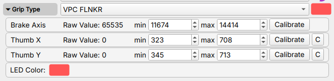

Inside the Settings tab, you will find a **Grip Type** dropdown menu. This allows you to select the type of grip connected to your Rhino, such as VKB, Virpil, or another supported model. Select **Loopback** only when using the [RhinoLoopback application](#the-rhinoloopback-application) to bridge buttons from a separate USB device.

!!! tip
    Clicking the colored box allows you to set the LED color for the grip if supported.

**Accessing Calibration Settings:**

Once you've selected a grip type, click on the **"Grip"** label or expander to reveal the calibration interface for that specific grip. This section allows you to calibrate and configure individual axes on your grip.

**Axis Calibration Widget:**

Each axis (brake, rudder, etc.) has its own calibration row with the following components:

- **Axis Name:** Identifies which axis is being calibrated (e.g., "Thumb X Axis", "Thumb Y Axis", "Brake")
- **Raw Value:** Displays the current raw sensor reading from the axis in real-time. This value updates as you move the control, showing the unprocessed input from the sensor.
- **Min:** Sets the minimum calibration value for the axis range. Adjust this to define where 0% begins.
- **Max:** Sets the maximum calibration value for the axis range. Adjust this to define where 100% ends.
- **Calibrate Button:** Activates the automatic calibration mode:

    - Click to enable calibration mode
    - Move the axis through its full range of motion (from one extreme to the other)
    - The min/max values will automatically update to capture the full travel range
    - Click again to deactivate the button and exit calibration mode
    - Click **Apply Config** to apply the new calibration
    - Click **Store Config** if you want to save it permanently

- **Center Button (C):** Readjusts the calibration values so that the current stick position becomes the new center point. Useful for correcting center offset without recalibrating the entire range.

**Calibration Workflow:**

1. **Select your grip type** from the dropdown
2. **Expand the Grip section** to access calibration controls
3. **Click "Calibrate"** for the axis you want to calibrate
4. **Move the axis** through its complete range of motion (full deflection in all directions)
5. **Verify** that the min/max values have been captured correctly
6. **Click "Apply Config"** to apply the calibration
7. **Click "Store Config"** if you want to save it permanently
8. **Test** the axis movement to ensure proper range and centering

!!! tip "When to Calibrate"
    - After installing a new grip
    - If you notice reduced axis range or dead zones
    - When the center position has drifted
    - After swapping between different grips

!!! note "Multiple Axes"
    Some grips may have additional axes like brake or twist axis. Each axis can be calibrated independently using the same process.

#### Understanding the Relationship: Effects Tab vs Settings Tab

The interaction between these two tabs determines how the Rhino behaves:

**Effects Tab - Local Effect Configuration:**

- Enables and tunes effects generated by the Configurator itself
- Active when no simulator is running
- Individual effects can be selectively overridden by simulators
- Example: If a game creates its own spring effect, only the spring from the Effects tab is disabled - other effects (damper, friction, etc.) remain active

**Settings Tab - Global Force Limiters:**

- Sets maximum force output for each effect type as percentage multipliers
- Acts as a global cap on **all** effects, regardless of source
- Always applies, whether effects come from Configurator, simulator, or TelemFFB
- Example: If "Spring" slider is set to 80%, any spring force from any source is limited to 80% of potential strength

**TelemFFB Integration:**

TelemFFB can also override individual effects in the same way a simulator does, replacing only the specific effect types it controls while leaving others active.

**Quick Reference:**

| Aspect | Effects Tab | Settings Tab |
|--------|-------------|--------------|
| **Purpose** | Configure local effects | Set maximum force limits |
| **Scope** | Only Configurator-generated effects | All effects from any source |
| **Override Behavior** | Can be overridden by simulator | Always applies as final limiter |
| **Use Case** | Fine-tune effect behavior | Quick global adjustments |

!!! example "Practical Example"
    You've configured a perfect spring effect at 70% gain in the Effects tab, and set damper at 40%. In the Settings tab, you have Spring at 100% and Damper at 80%.
    
    - **No simulator running:** You feel 70% spring and 32% damper
    - **DCS running with native FFB:** DCS controls the spring (your 70% is ignored), but your 40% damper remains active, limited by the 80% Settings multiplier (= 32% final damper)
    - **Settings adjustment:** Lower Spring slider to 50% in Settings - now any spring force (DCS or local) is halved

### Debug Tab

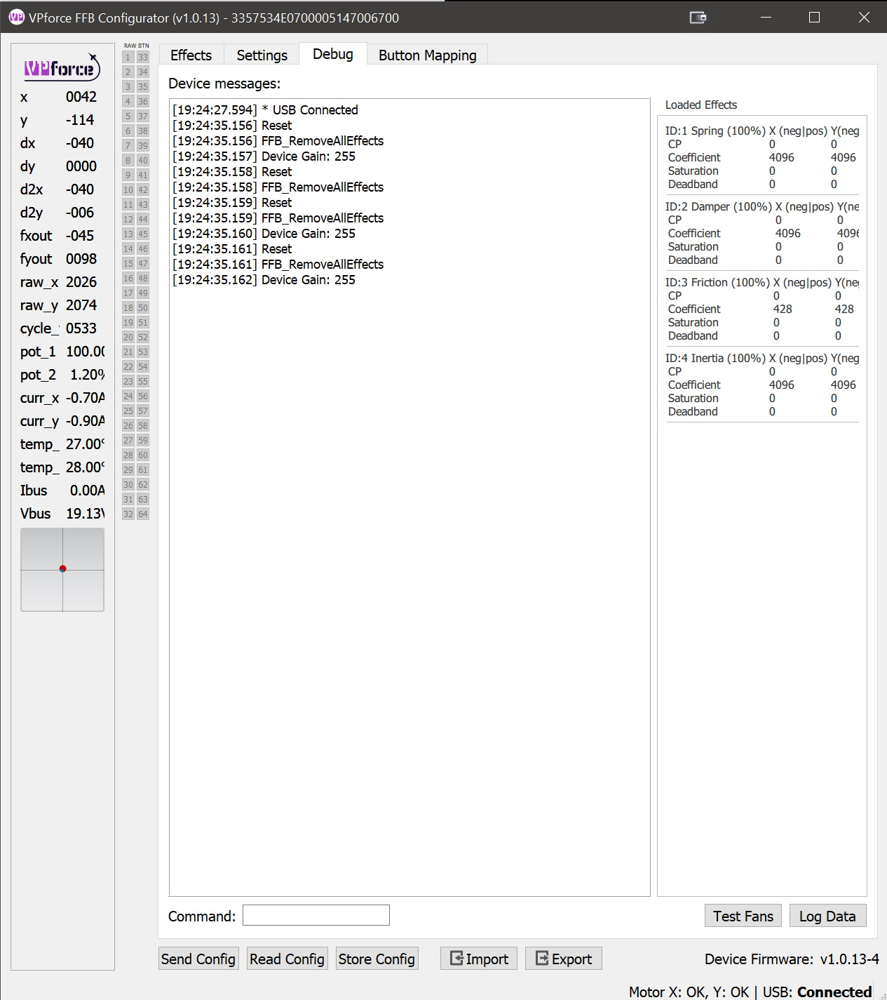{ width="514px" height="579px" }

The **Debug Tab** provides real-time monitoring, diagnostic tools, and troubleshooting information. Use it to see what the device is doing internally and to identify conflicts or faults.

#### Main Features

**1. Device Log Output**

A real-time console displaying messages, warnings, and errors from the Rhino's firmware. This log is invaluable for:

* Tracking system events and state changes
* Identifying error conditions and faults
* Monitoring USB communication status
* Debugging configuration issues

**2. Effect Monitor**

The Effect Monitor provides a live view of all currently loaded FFB effects, showing:

- **Effect Status:** Active or Inactive state for each effect
- **Parameter Values:** Real-time display of current gain, saturation, direction, and other parameters
- **Source Indicators:** Badge showing the origin of each effect:
    - **Configurator:** Effects generated by the VPforce FFB Configurator
    - **Game:** Effects sent by the simulator or game
    - **TelemFFB:** Effects generated by the TelemFFB application

This monitor shows which effects are active and where they come from. That makes it useful when force feedback feels wrong or inconsistent.

**3. Diagnostic Tools**

The Debug tab includes several utility functions:

- **Fan Test:** Manually activate cooling fans to verify operation
- **Data Logging:** Capture detailed telemetry and diagnostic data for support tickets
- **Motor Reset:** Reset motor controllers to clear fault states or recover from errors
- **Command Pane:** Direct access to low-level device commands for advanced diagnostics and configuration

#### Use Cases

- **Troubleshooting FFB Issues:** Check which effects are active and their source when behavior seems wrong
- **Performance Monitoring:** Watch effect parameters change in real-time during gameplay
- **Support Requests:** Capture logs and diagnostic data to help support teams identify issues
- **Effect Conflicts:** Identify when multiple sources, such as a game, TelemFFB, and the Configurator, are trying to control the same effect type

!!! warning "Advanced Features"
    The Command Pane and some diagnostic functions are intended for advanced users or support-guided troubleshooting. Incorrect commands can temporarily affect device behavior until reset.

### Button Mapping Tab

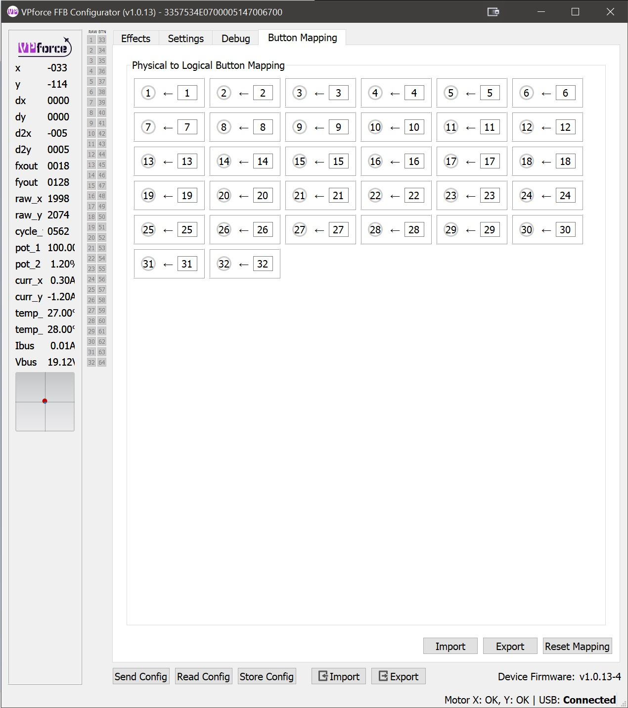{ width="624px" height="702px" }

The **Button Mapping Tab** allows you to configure how buttons on your grip are recognized and mapped by the system. This is where you can:

- **Assign Button Functions:** Map physical buttons to specific button numbers recognized by games
- **Test Inputs:** Verify that button presses are being detected correctly

### Spring Gain Mapping Tab

**Spring Gain Mapping** is an advanced tuning tool for reshaping spring feel. You can make the stick lighter or heavier at different positions, or remap how simulator force commands translate into actual resistance.

This is especially useful in simulators like DCS, where native force feedback often saturates early.

#### Understanding the Basics: What Is Dynamic Range?

Think of the stick motors as a dimmer switch that runs from 0% to 100%:

- **At 100% force setting:** The resistance gradually increases as you move the stick. The motors only hit maximum power when you've pushed the stick all the way to the edge. This gives you the full range of feeling - light forces near center, heavy forces at the edges.

- **At 300% force setting:** The motors hit maximum power when you've only pushed the stick one-third of the way. After that point, you can't feel any additional increase in force because the motors are already working at full capacity. This is called "saturation."

**Trade-off:** Higher force settings make the stick stiffer, but reduce the amount of subtle force variation you can feel across the full range of motion.

#### The Simulator Problem

Most DCS aircraft send a "set spring to 100%" command very early, often at relatively low airspeeds. After that, stick stiffness no longer increases, even though real aircraft controls would keep getting heavier.

The F-4 Phantom is a rare exception - it lets you reduce its force feedback saturation range in-game, giving you room to compensate using the Rhino's settings. But most aircraft don't offer this option.

**Critical limitation:** Once DCS sends "100%", the missing force-versus-airspeed information is gone. The simulator is no longer telling the device how much stiffer the controls should become.

**TelemFFB solution:** TelemFFB reads telemetry data directly from DCS and can augment or replace the native force curves. By monitoring airspeed, G-forces, and other flight parameters, it can rebuild a more realistic force-versus-airspeed relationship even after native FFB has saturated.

#### What Spring Gain Mapping Can Do

Spring Gain Mapping gives you two powerful tools to work around these limitations:

**1. Force vs Displacement Mapping**

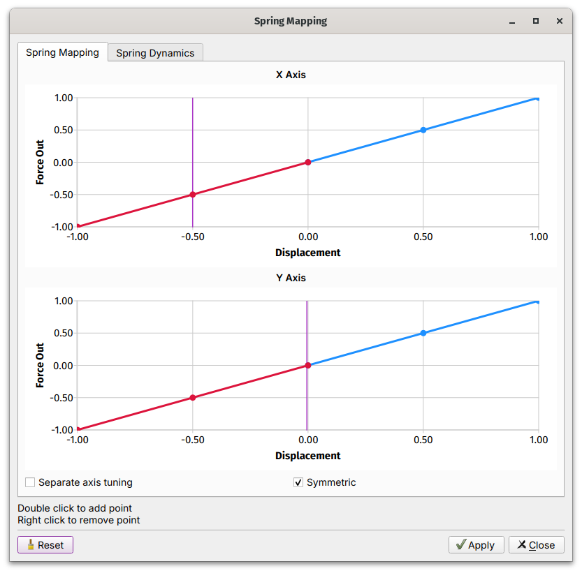{ width="671px" }

This controls how force increases as you move the stick away from center:

- **Default (linear):** Force increases evenly with distance. Push the stick halfway, feel 50% force. Push it all the way, feel 100% force.
- **Custom curves:** You can reshape this relationship:

    - Make the stick lighter near center but stronger at the edges
    - Boost peak force beyond 100% (say, 150-200%) at full deflection
    - Create a progressive feel that ramps up more aggressively as you approach the limits

**Example:** You want a lighter touch near center for fine control, but stronger resistance at the edges to prevent over-controlling. You'd create a curve that starts shallow and steepens as displacement increases.

**2. Game Gain Remapping**

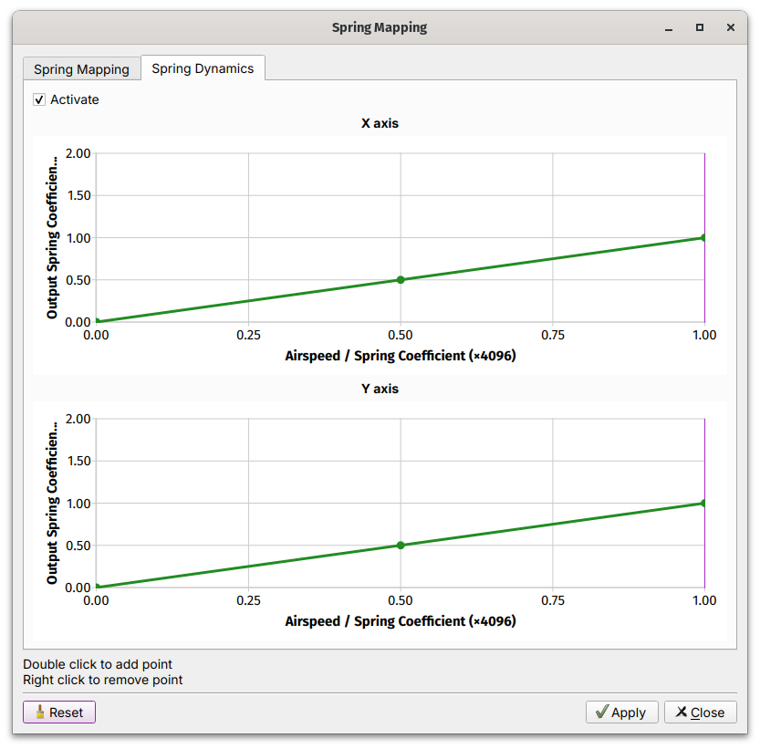{ width="671px" }

This changes how the simulator's force commands translate into actual force:

- **Default (linear):** Simulator says "50% force" → you feel 50% force
- **Custom curves:** You can amplify or compress the simulator's commands:

    - Boost low-force commands so the stick never feels too limp
    - Compress high-force commands to prevent excessive stiffness
    - Create your own force progression even when the sim caps out early

**Example:** DCS sends 100% force at 200 knots and never increases. You create a curve that remaps that "100%" command to 70% actual force, leaving room for additional stiffness later, whether through TelemFFB or manual adjustment.

#### How to Use Spring Gain Mapping

1. Open the VPforce Configurator
2. Navigate to the **Spring Gain Mapping Tab**
3. Choose which curve you want to edit:

    - **Force vs Displacement** - Changes how force builds with stick position
    - **Gain Remapping** - Changes how simulator commands map to actual force

4. Click points on the curve to adjust the shape
5. Test in your simulator and refine until it feels right

#### Practical Tips

**Start Simple**

Do not try to fix everything at once. Start with modest adjustments, such as 120-150% peak force, and test.

**Understand the Trade-offs**

- **Higher peak forces:** More satisfying resistance, but less ability to feel subtle force changes
- **Lower saturation:** More dynamic range, but lighter overall feel

**Know the Limitations**

If DCS is sending "100% force" early and staying there, Spring Gain Mapping can redistribute that force in more useful ways, but it cannot create missing information. For more realistic force-versus-airspeed behavior, use TelemFFB or an aircraft like the F-4 that gives you more control over in-game saturation.

**Monitor Heat**

Sustained high forces generate motor heat. If you're running high gain settings for extended periods, keep an eye on thermal performance.

!!! tip "The F-4 Exception"
    If you fly the F-4 Phantom in DCS, you're in luck. You can reduce the in-game force feedback saturation range, then use Spring Gain Mapping to boost the output back up. This gives you much more control over how forces scale with airspeed.

!!! warning "Information Loss"
    Once a simulator sends "100%" and stops increasing, there is no way to recover the missing force-versus-airspeed data. Spring Gain Mapping can reshape *how* that force feels, but it cannot create realism the simulator is not providing. For advanced effects like realistic airspeed-dependent forces, consider using TelemFFB.

### FFB Axes Setup Tab

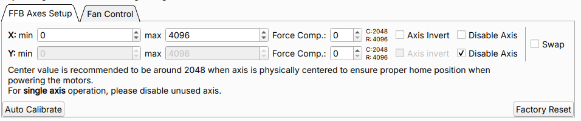

The **FFB Axes Setup Tab** defines the input limits, logical center position, and behavior of the Rhino's X and Y axes. Proper axis configuration ensures accurate positional mapping and correct centering when the motors are active.

Use this tab during initial setup, after hardware replacement, or when troubleshooting calibration issues.

#### Axis Range Configuration

**X min / X max, Y min / Y max** -
These parameters define the raw values mapping range for each axis.

- **Default range:** 0 to 4096
- **Expected center:** Near 2048 when the stick is physically centered
- **Purpose:** Used for scaling input values and calculating force feedback output

The center value should read approximately 2048 when the stick is physically at rest in the neutral position. Significant deviation from this value may indicate mechanical misalignment or the need for recalibration.

!!! important "Center Value Warning"
    If the center value is far from 2048 (e.g., below 1900 or above 2200), the `C:xxxx` indicator will turn red. This indicates misalignment between the motor encoder values and mechanical position. See [The Multi-Turn Problem](../community-projects/tips-and-tricks.md#the-multi-turn-problem) for more information.

#### Force Compensation

**Force Comp. (Force Compensation)** —
Force Compensation corrects for mechanical flex that occurs under high spring force loads.

**The Problem:**

The Rhino uses its motors as position sensors — motor shaft encoders report the logical axis position. Any mechanical flex in the gimbal structure (belts, linkages, frame) that occurs between the grip and the motor shaft is invisible to this measurement. Under high FFB spring forces, the mechanical load causes the system to flex slightly. This means:

- The stick physically reaches or approaches the end of its travel
- But the motor encoder — measuring at the motor shaft — has not registered full deflection
- The logical axis value never reaches the calibrated edge value that was recorded during auto-calibration

The result is that the axis appears to fall short of its full range under load, even though mechanically the stick is at the stop.

**The Solution:**

Increasing Force Compensation adds an outward positional offset near the axis extremes, effectively extending the reported range to compensate for the lost travel caused by mechanical compliance. This restores accurate input-to-output mapping throughout the full range of motion, even under high spring forces.

**Configuration:**

- Adjustable independently for each axis (X and Y)
- Higher values apply a larger correction at the axis extremes
- Typical starting point: values of 5-10 for light setups; increase incrementally until axis extremes read correctly under load

!!! note "Not a Gain Parameter"
    Force Compensation does not adjust force strength. It adjusts the reported position near axis limits to counteract the effect of mechanical flex under load.

!!! warning "Excessive Flex May Indicate a Hardware Problem"
    Some degree of mechanical flex is normal. In light setups, small values may be enough. In heavier setups with strong spring forces, much larger values can still be normal. If you need unusually large compensation, or if the flex is visibly pronounced, this may point to an underlying hardware issue such as loose or slipping belts, worn or broken gimbal components, or a structural problem. Investigate the root cause rather than relying only on software compensation.

**Axis Invert** - Reverses the logical direction of axis input and the corresponding force feedback polarity.

- **When to use:**

    - Mechanical orientation causes inverted behavior (forward stick input registers as backward)
    - Matching specific simulator or game expectations

---

**Disable Axis** - Disables processing and FFB output for the selected axis.

- **When to use:**

    - Single-axis setups (e.g., collective-only configuration)
    - Testing hardware individually during troubleshooting
    - Isolating issues to determine if one axis is malfunctioning

!!! tip "Troubleshooting with Disable Axis"
    If experiencing calibration errors or erratic behavior, temporarily disable one axis to determine if the issue is isolated to a specific axis or affects the entire system.

---

**Swap Axes** - Swaps the X and Y axis mappings.

- **When to use:**

    - Gimbal wiring layout differs from expected configuration
    - Mechanical assembly results in rotated axis orientation
    - Quick correction without rewiring hardware

#### Calibration Tools

**Auto Calibrate** - Automatically measures and records the physical limits and center position by sampling the live axis range.

**Calibration process:**

1. Click **Auto Calibrate**
2. Move the stick through its full range of motion in all directions
3. Ensure the stick reaches all physical stops (forward, back, left, right, and corners)
4. The system captures minimum, maximum, and center values for both axes
5. Click **Auto Calibrate** to deactivate the button
6. Click **Apply Config** to activate the calibration
7. Click **Store Config** if you want to save it permanently

- **When to calibrate:**

    - Initial setup of a new Rhino device
    - After replacing gimbal components
    - When center position has drifted due to belt slip
    - After mechanical maintenance or adjustments

---

**Factory Reset** - Restores default calibration values, clearing all user modifications.

**Default values restored:**

- Range: 0 to 4096
- Center: 2048
- Force Compensation: 0 (disabled)

**When to use:**

- Starting fresh after extensive modifications
- Troubleshooting calibration issues by returning to known baseline
- Preparing device for handoff to another user

!!! warning "Configuration Loss"
    Factory Reset clears all axis calibration data. Make note of current settings before resetting if you may want to restore them later.

#### Verification and Testing

After calibration or configuration changes:

1. **Verify center position:** With the stick physically centered, confirm the raw values read near 2048 for both axes
2. **Check full range:** Move the stick to each physical stop and verify that logical limits match mechanical stops
3. **Test FFB response:** Enable a spring effect and confirm that centering force behaves correctly

#### Usage Notes and Best Practices

- **Recommended center value:** Approximately 2048 when the stick is physically centered. Deviation of more than ±50 may indicate mechanical issues.
- **Disable unused axes:** For single-axis configurations, always disable the unused axis.
- **Force Compensation tuning:** Start with low values (5–10) and increase incrementally if the axis does not reach its full calibrated range under high spring forces.
- **Regular verification:** After firmware updates or mechanical maintenance, verify that calibration remains accurate.

## The RhinoLoopback Application

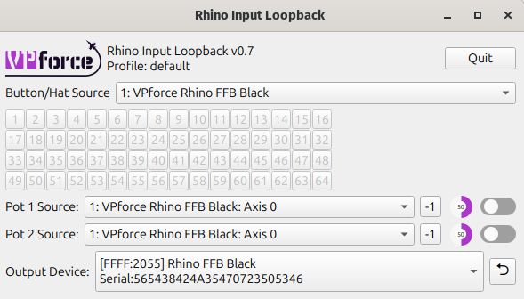

### Purpose and Overview

**RhinoLoopback** bridges button inputs from an external USB controller to the Rhino. It is intended for grips that connect through **passthrough cables**. In that setup, the Rhino does **not** read the grip buttons directly. Another USB device, such as a VKB Gunfighter base, reads them and RhinoLoopback forwards them to the Rhino.

!!! important "When You Do NOT Need Loopback"
    If your grip connects **directly** to the Rhino's grip connector (e.g., Virpil, WinWing, or other SPI grips), the Rhino already reads those buttons natively. You do **not** need RhinoLoopback — just select the correct grip type in the Configurator's **Settings** tab and the buttons will appear.

### Common Use Cases

- **VKB Grips:** VKB grips connected via passthrough cable — the VKB base handles button input over USB, and Loopback bridges those buttons to the Rhino for use with hardware force trim or other Configurator functions
- **External Controllers:** Mapping buttons from a gamepad or secondary USB device to control Rhino functions (e.g., binding a gamepad button to hardware trim release)
- **Flexible Configurations:** Using a non-grip USB device to trigger Configurator features without rewiring

### Setup Instructions

**Step 1: Launch the Application**

1. Navigate to the folder where you extracted **VPforce_FFB_Configurator_vx.x.xx.zip**
2. Run **RhinoLoopback.exe** - a configuration window will appear

**Step 2: Configure Devices**

1. **Input Device:** Select the controller whose buttons you want to use (e.g., *VKBsim Gunfighter MCG Ultimate*, gamepad, or any other HID device)
2. **Output Device:** Select your Rhino (usually the only device listed)

**Step 3: Enable Loopback Mode**

1. Keep the RhinoLoopback application **running** - it must stay open for loopback to function
2. In the VPforce FFB Configurator, go to the **Settings** tab
3. Set **Grip Type** to **Loopback**

**Step 4: Configure Button Mappings**

Once loopback is active, the FFB Configurator recognizes buttons from the selected input device. You can then assign them to hardware force trim, mode switches, or other Configurator features.

!!! tip "Keep It Running"
    RhinoLoopback must remain running in the background for button inputs to be passed through to the Configurator. You can minimize it, but do not close it.

!!! note "Multiple Devices"
    If you have multiple Rhino devices or controllers, ensure you select the correct pairing in the dropdowns to avoid confusion.

### Command Line Options

*RhinoLoopback* supports several command line options for advanced users:

- `--profile <name>` : Load a specific configuration profile eg. one could setup different device configurations for joystick and for collective. The default profile is named `default`.

## Balancing the Grip

### Understanding the Problem

When using heavier grips or extension pieces, you may notice the joystick sagging or drifting when trimmed at an angle. This happens because gravity creates additional torque that must be counteracted to hold the stick in position.

**The Physics:**

- Standard spring force is proportional to displacement from center
- A heavy grip at an angle creates constant downward torque
- The stick "falls" slightly until spring force balances the weight
- This drift is most noticeable with weaker spring settings

### Balance Spring Feature

The **Balance Spring** feature, found in the VPforce Configurator, compensates for grip weight and orientation by applying directional bias forces. This allows you to achieve perfect trim performance regardless of grip weight or extension length.

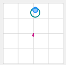{ width="131px" height="128px" }

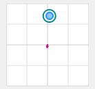{ width="138px" height="129px" }

!!! note
    Before adjusting *"Balance Spring"*, disable Spring, Damper, Friction, and Inertia so the result is not masked by other effects.

### Adjusting Balance Spring Settings

**Preparation:**

Before adjusting Balance Spring, disable the following effects in the **Effects** tab:

1. In the VPforce Configurator **Effects** tab, disable:

    - Spring
    - Damper
    - Friction
    - Inertia

**Configuration Steps:**

In the "Balance Spring" section, you will see four directional strength controls:

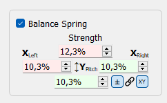{ width="242px" height="149px" }

**Directional Adjustments:**

- **Left/Right:** Compensates for side-to-side imbalance
    - Increase if the stick sags to one side when released at angle
    - Typical causes: Offset grip mounting, heavy side panels, or asymmetric extensions

- **Forward:** Compensates for front-heavy configurations
    - Increase if the stick tilts forward when released
    - Common with grips that have heavy front modules or long forward extensions

- **Backward:** Compensates for rear-heavy configurations
    - Increase if the stick tilts backward when released
    - Typical with grips that extend behind the base mounting point

**Tuning Process:**

1. **Test at Multiple Angles:** Move the stick to various positions (forward, back, left, right, and diagonals)
2. **Release and Observe:** Let go of the stick and watch which direction it drifts
3. **Adjust Incrementally:** Make small adjustments to the appropriate directional value
4. **Re-test:** Repeat steps 1-3 until the stick holds position reliably at all angles
5. **Re-enable Effects:** Once satisfied, turn your Spring/Damper/Friction/Inertia effects back on

!!! tip "Finding the Sweet Spot"
    Start with small adjustments of 5-10% and work upward. It is easier to add compensation than remove too much. The goal is for the stick to stay where you leave it when released at any angle.

### Adaptive Recentering

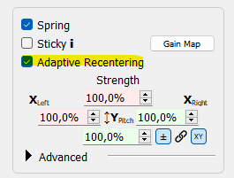{ width="265px" height="201px" }

**Adaptive Recentering** is an intelligent system that works alongside Balance Spring to achieve even more precise trim positions. While Balance Spring provides static compensation, Adaptive Recentering dynamically adjusts forces to minimize positioning errors.

#### How It Works

The system continuously monitors the difference between:

- The **commanded position** (where the trim or spring center is set)
- The **actual stick position** (where the stick physically is)

When it detects a discrepancy, it slowly applies corrective force to bring the stick exactly to the commanded position. This correction happens gradually to avoid sudden jerks or oscillations.

#### Compatibility

Adaptive Recentering works with any **Spring-class effects** from:

- DirectX games with native FFB support
- TelemFFB-generated spring effects
- Configurator local spring effects

#### Limitations and Considerations

**Authority Limits:**

- The system's corrective force is limited by current spring strength
- At low spring settings (below ~30%), it may lack sufficient authority to fully correct positioning errors
- In these cases, proper Balance Spring configuration is essential

**Best Practice:**

- Configure Balance Spring first to handle the majority of static weight compensation
- Enable Adaptive Recentering to handle fine adjustments and dynamic corrections
- Use moderate to high spring strengths for optimal Adaptive Recentering performance

!!! note "Complementary Features"
    Think of Balance Spring as your coarse adjustment and Adaptive Recentering as your fine tuner. Balance Spring handles the predictable weight-based forces, while Adaptive Recentering corrects for minor errors and dynamic factors.

### Static Force

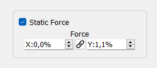{ width="268px" height="117px" }

**Static Force** applies a constant directional force, similar to attaching a rubber band that continuously pulls in one direction. This setting is particularly useful for extreme weight imbalances or specialized applications.

#### When to Use Static Force

**Heavy Weight Imbalance:**

- Stick is significantly front-heavy or rear-heavy
- Balance Spring alone isn't providing enough compensation
- You need a constant pull to counteract persistent drift

**Specialized Applications:**

- Simulating counterbalance springs in custom FFB collectives
- Creating intentional force bias for specific aircraft types
- Compensating for unusual mounting angles or configurations

#### Configuration

Static Force can be set to positive or negative values:

- **Positive values:** Apply force in the defined direction
- **Negative values:** Apply force in the opposite direction
- **Magnitude:** Determines the strength of the constant force

!!! tip "Collective Builders"
    When building a custom FFB collective, Static Force is invaluable for simulating the counterbalance springs found in real helicopter collectives. These springs help the collective "float" at a set position rather than falling to the bottom under its own weight.

!!! warning "Use Sparingly"
    Static Force applies continuously, which means it's always consuming motor authority and generating heat. Use only as much as needed and prefer Balance Spring adjustments when possible.

## Thermal Management

The Rhino's two servo motors generate significant thermal energy during continuous operation, particularly under sustained high forces or extended flight sessions. Understanding how thermal buildup occurs and how to manage it will help you get the most out of your device.

### How the Motors Heat Up

The Rhino's motors operate near stall speed, holding torque against your input rather than spinning freely. In that mode, most electrical power becomes heat in the windings rather than mechanical motion.

Heat generation follows $P = I^2R$. In practical terms, that means small increases in current demand can create much larger increases in heat. Under strong sustained effects or long sessions, motor temperature rises because heat builds faster than it can dissipate.

As temperature increases, the device gradually reduces available torque to protect itself and reach a sustainable thermal balance. You may notice weaker forces near the thermal limit, but full output returns once the motors cool.

### Built-in Cooling System

The Rhino includes an active cooling system with two fans that automatically engage when the motor temperature reaches 50°C. These fans draw air through the base to dissipate heat from the motors and internal components. As long as the fans have adequate airflow, they will effectively manage thermal buildup during normal use.

### Optimizing Cooling Performance

To ensure the cooling system works at its best:

- **Maintain clearance around the base:** Leave room around the sides and bottom so air can enter and exit freely.
- **Keep vents clear:** Remove dust and debris from the fan vents periodically.
- **Ensure proper ventilation:** Avoid hot or enclosed spaces with poor airflow.
- **Consider ambient temperature:** In warm rooms, the motors reach operating temperature faster and the fans may run more often.

### Managing Thermal Load During Use

If you find the Rhino is throttling heavily or the fans are running constantly, consider these strategies:

- **Reduce Master Gain:** Lower overall output to reduce motor load and heat.
- **Take breaks:** Long sessions with high forces naturally accumulate heat.
- **Balance effect strengths:** Tune effects individually instead of maximizing everything.

The built-in cooling and thermal protection are designed for normal use. In most setups, you will only need basic airflow awareness and sensible gain settings.

## Leaving the RHINO Idle

There is no single required way to leave the Rhino between sessions. The best option depends on how your rig is powered and whether you want the external PSU left energized.

For most users, these are the practical options:

- **Leave USB connected and shut down the PC:** This is the simplest approach. If **USB suspend** is enabled in the VPforce Configurator, the Rhino will go to sleep when the PC powers down and the motors will de-energize.
- **Press the E-stop button:** If you want the Rhino to stay connected but want motor power removed immediately, press the E-stop.
- **Switch off the full power strip:** If you prefer everything fully off, switch off the strip that powers the PC and the Rhino PSU.

!!! important "USB suspend controls sleep behavior"
    Automatic sleep only works when **USB suspend** is enabled in the VPforce Configurator. This setting is enabled by default. If you have turned it off, the Rhino may remain awake over USB after the PC shuts down until you press the E-stop or remove power.

In short, leaving the Rhino plugged in is generally fine. If you want a faster start-up next time, leave it connected and let it sleep. If you want the motors positively disabled, use the E-stop. If you want the whole system unpowered, switch off the power strip.

!!! tip "Simple rule of thumb"
    PC off + **USB suspend enabled** = the Rhino can sleep safely over USB. For an extra layer of reassurance, press the E-stop. For a full electrical shutdown, turn off the power strip.